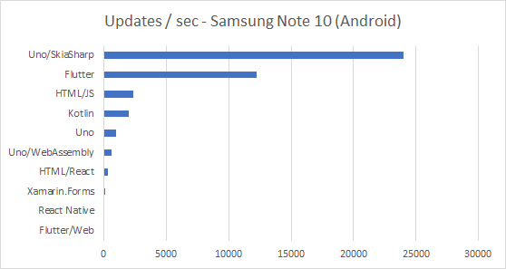
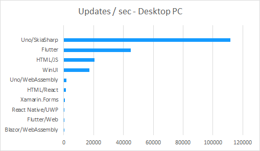

# Dopes/s Test Benchmark

Following [this post on the FlutterDev subreddit](https://amp.reddit.com/r/FlutterDev/comments/gztwcu/flutter_performance_considerations_vs_react_and/), Uno did its own version of those tests.

## Results on Android device

| Technology      | Note 10 |
| --------------- | ------: |
| Flutter/Web     |       9 |
| React Native    |      67 |
| Xamarin.Forms   |     145 |
| HTML/React      |     337 |
| Uno/WebAssembly |     640 |
| Uno             |     947 |
| Kotlin          |    2000 |
| HTML/JS         |    2350 |
| Flutter         |   12210 |
| Uno/SkiaSharp   |   24017 |

## Results on a Desktop PC

| Technology         | Desktop PC |
| ------------------ | ---------: |
| Blazor/WebAssembly |          8 |
| Flutter/Web        |         20 |
| React Native/UWP   |         30 |
| Xamarin.Forms      |        588 |
| HTML/React         |       1592 |
| Uno/WebAssembly    |       1927 |
| WinUI              |      17321 |
| HTML/JS            |      20756 |
| Flutter            |      45024 |
| Uno/SkiaSharp      |     111762 |

